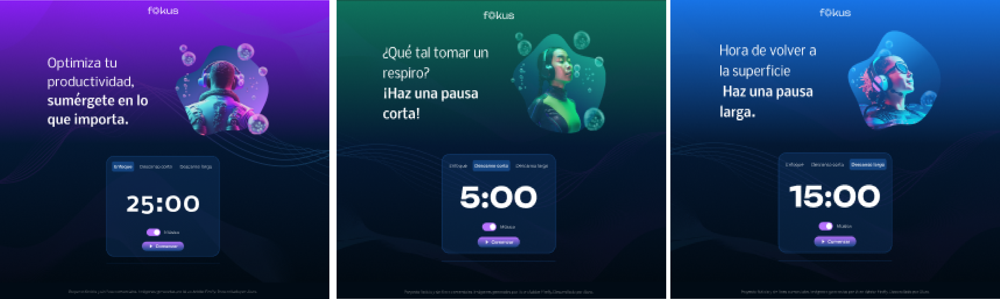

<h1 align="center"> PROYECTO FOKUS </h1>

<h1 align="center"> Front End G6 - ONE </h1>
 
# Curso JavaScript manipulando elementos en el DOM 

👩‍💻 💻 Desarrollo del proyecto Fokus: "temporizador que ayuda a los usuarios a concentrarse en sus actividades diarias. "   

El proyecto del curso es Implementar el objeto Date: 
* Entendimos cómo implementar el objeto Date de JavaScript en el proyecto Fokus para formatear minutos y segundos.
* Configurar diferentes temporizadores: Configuramos el temporizador para tres contextos diferentes: enfoque, descanso
   corto y descanso largo.
* Insertar el temporizador en la pantalla: Creamos la función "mostrarTiempo()" y utilizamos el método innerHTML
   para mostrar el temporizador en la pantalla.

     
     
     
   

 
  ❤️ ESTADO: Finalizado
 

## 🔎 Deploy

  <h3>
    <a href="https://bety2022.github.io/AluraMidi/" >
      🔗 Visitar la Plataforma del Temporizador Fokus
    </a>

 

## 🛠️ Herramientas implementadas 
  - DOM
  - Layouts
  - Flexbox
  - CSS
  - HTML
  - JavaScript
  - Git || GitHub || GitHub Pages

    

 

 

## 📧 Contacto
¿Tienes un proyecto en mente? Conectémonos y hagamos que las cosas sucedan! Puedes escribirme a carolinalopezdatascientist@gmail.com o seguirme en [LinkedIn](https://www.linkedin.com/in/carolina-lopez-430208106/).
  
